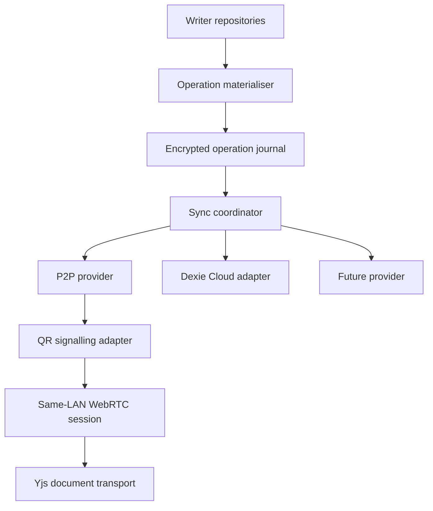

# Writer Sync foundation and QR-paired P2P runbook

**Status:** implementation plan  
**Prepared against:** `DopaMindLabs/writer` → `feat/collaborative-editing` at `9a94c59`  
**Date:** 23 July 2026  
**Delivery model:** Stage 1 completes the provider-neutral foundation. Stage 2A ships same-user, serverless QR-paired P2P over the same local network as Writer’s configured default. Stage 2B later adds internet rendezvous and relay support. Multi-user collaboration remains a later stage.

---

## 1. Outcome

Writer should ship with QR-paired peer-to-peer synchronisation as its default configuration while the underlying Writer Sync module remains neutral about:

- which provider is enabled;
- which provider is the application default;
- whether zero, one or several providers operate at once;
- how devices discover or pair with one another;
- whether a provider uses WebRTC, Dexie Cloud, a Writer server, LAN, Bluetooth or another mechanism;
- which application consumes the module.

The reusable boundary should become one package:

```text
@dopamind/writer-sync
├── /core
├── /crypto
├── /pairing
├── /providers/webrtc
└── /adapters/yjs
```

The similar directory names must not represent parallel engines:

| Path | Responsibility |
|---|---|
| `packages/writer-sync/` | The reusable, framework-neutral Writer Sync engine. The kebab-case name matches the npm package `@dopamind/writer-sync`. |
| `src/lib/writerSync` | The current Writer-specific composition and React integration. It is temporary and must be renamed or split during extraction. |
| `src/lib/syncProviders` | The current provider-neutral contracts. They move into `packages/writer-sync`; this directory must not survive as a second core. |

Stage 1 must finish with `packages/writer-sync/` for reusable logic and `src/lib/writerSyncIntegration/` (plus ordinary hooks/contexts where appropriate) for Writer-specific configuration, startup and React wiring. After the move, neither `src/lib/writerSync` nor `src/lib/syncProviders` may retain duplicate general sync logic.

Writer-specific UI, Dexie row materialisation and access to Writer’s tables stay in the Writer app. The Dexie Cloud adapter should remain in the app until it no longer depends on Writer’s concrete database and cloud-account flows; it can then move behind an additional package export without changing the core API.

Do not create a separate repository yet. Establish the package inside the Writer repository, exercise it against the real app, and publish or extract it only after Stage 2A stabilises its public contracts.

---

## 2. Direct architectural answer

### 2.1 Can this be its own reusable module?

Yes. It should be a package with framework-neutral ports rather than a copy of Writer’s current `src/lib/cloud/` code.

The package may depend on browser-standard primitives such as Web Crypto and WebRTC at its provider edges. Its core must not import React, Writer schema types, Dexie, `dexie-cloud-addon`, Lexical or Yjs.

Another repository should be able to provide:

- its own `OperationStore`;
- its own `OperationMaterializer`;
- its own application configuration and defaults;
- its own pairing UI;
- its own signalling implementation;
- any combination of `SyncProvider`s.

### 2.2 Should abstraction wait until later?

Public npm release can wait. The boundary cannot.

Stage 1 should first make the existing in-app modules obey the intended dependency direction and contract tests. Once those tests pass, move the pure modules into the workspace package without changing behaviour. Stage 2A should then build the P2P implementation against the package, preventing it from becoming inseparable from Writer.

### 2.3 Do we need Signal?

Not for Stage 2A.

Signal Protocol solves asynchronous, pairwise secure messaging using identity keys, pre-keys and a Double Ratchet. It does not discover peers, exchange WebRTC offers and answers, synchronise Writer records or integrate Yjs. Adding it would not remove the need for a pairing protocol, device trust, a key vault, operation deduplication or CRDT integration.

Stage 2A needs:

- QR as the trust-bootstrap and serverless signalling method;
- a two-way QR offer/answer exchange containing complete WebRTC session descriptions and gathered local ICE candidates;
- WebRTC data channels for direct transport between devices on the same reachable LAN;
- Writer Sync application-layer encryption and signed device identity;
- a provider-neutral operation protocol for catch-up;
- the existing Yjs protocol for live document collaboration.

WebRTC data channels are already protected by DTLS, but application-layer encryption remains required so security does not depend on the selected transport and the same operation format can later cross a relay or durable provider.

Re-evaluate Signal or MLS only when the product enters cross-user collaboration:

- consider a Signal-style ratchet for pairwise, asynchronous messaging where a server stores pre-key bundles and queued messages;
- consider Messaging Layer Security for larger changing groups;
- do not design either into the same-user P2P release speculatively.

### 2.4 Is a server required?

No—not for Stage 2A.

WebRTC requires offer, answer and ICE information to be exchanged, but it does not require that exchange to use a server. In the browser-only first release, QR itself is the signalling channel:

1. Device A gathers local candidates and displays an offer QR.
2. Device B scans the offer, creates an answer and displays an answer QR.
3. Device A scans the answer.
4. The peers authenticate the transcript and open a direct WebRTC data channel over the local network.

This is a two-scan flow. A pure browser cannot reliably expose a temporary inbound TCP/UDP endpoint, so one scan cannot also return Device B’s answer without another channel. A future Electron, Tauri or native host may provide a one-scan local rendezvous adapter, but that must remain an interchangeable adapter rather than a core assumption.

Stage 2A deliberately requires:

- both devices to be active at the same time;
- both devices to be on the same reachable Wi-Fi/LAN or personal hotspot;
- no hosted signalling service;
- no STUN service;
- no TURN relay;
- explicit failure guidance for guest Wi-Fi or client isolation.

Bluetooth is not the browser baseline. A future native adapter may use Bluetooth for discovery or pairing and then switch bulk transfer to local Wi-Fi; it must not be assumed by the P2P core.

Stage 2B is the later internet release. It may add content-blind hosted signalling for a one-scan flow, STUN for NAT discovery and TURN as a ciphertext relay when direct connectivity fails. Those services implement existing ports; they do not change the Writer Sync operation, trust or encryption model.

---

## 3. Scope boundaries

### Stage 1 includes

- provider-neutral types, lifecycle and selection policy;
- zero/one/many-provider semantics;
- stable application access scopes;
- separate principal and device identities;
- `createdBy` and `updatedBy` audit metadata;
- a contextual key resolver;
- scope-bound encryption context;
- a device key vault that can support authenticated pairing without exposing a recovery code;
- one authoritative sync-table policy;
- a versioned, encrypted operation format;
- an idempotent operation journal, inbox and tombstones;
- application materialisation ports;
- a Dexie Cloud adapter that no longer leaks realm concepts into the core;
- package extraction inside the repository;
- contract, crypto, persistence and integration tests;
- architecture and technical-specification updates.

### Stage 1 does not include

- P2P networking;
- QR UI or camera access;
- a hosted signalling service;
- STUN/TURN deployment;
- multi-user invitations;
- cross-user key delivery;
- role provisioning or sharing UI;
- per-document sharing UI;
- secure device revocation through content-key rotation;
- a Signal/Double Ratchet or MLS implementation.

### Stage 2A includes

- same-user device identity and trust records;
- two-way QR pairing and signalling as Writer’s default local pairing method;
- same-Wi-Fi/LAN WebRTC peer sessions with no hosted infrastructure;
- a P2P `SyncProvider`;
- initial full-scope transfer and incremental catch-up while both peers are active;
- authenticated two-way QR reconnection for later browser sessions, without repeating key transfer;
- live Yjs updates and presence over the peer session;
- spaces, sections, documents, notes, attachments, annotations, citations, connections, revisions and palettes;
- deletion tombstones;
- deduplication when P2P and Dexie Cloud both deliver a change;
- device-list, pairing and removal UI;
- two-browser-context, same-LAN and real-device verification;
- clear detection and explanation of network/client-isolation failure.

### Stage 2A does not include

- sharing content with another person;
- server-authoritative RBAC;
- a guarantee that removing a device erases data it already downloaded;
- offline delivery while every peer is offline and no durable provider is enabled;
- hosted signalling, STUN or TURN;
- automatic browser peer discovery or background reconnection after both pages close;
- cross-network or internet pairing;
- browser-to-browser Bluetooth;
- arbitrary relay storage of content.

### Stage 2B later adds

- a content-blind hosted signalling adapter for internet rendezvous and a smoother one-scan flow;
- STUN configuration for NAT discovery;
- TURN fallback that relays only encrypted WebRTC/application traffic;
- reconnection across network changes;
- the operating, abuse-control, retention and cost decisions required by those services.

Stage 2B must reuse the Stage 2A ports. It must not make hosted infrastructure, QR, WebRTC or any single provider an architectural default.

---

## 4. Current branch assessment

| Area | Present at `9a94c59` | Foundation gap |
|---|---|---|
| Provider vocabulary | `src/lib/syncProviders/types.ts` defines optional capabilities | `EncryptedFrameSync` is implemented by Dexie row replication, not a common frame protocol |
| Coordinator | Registers several providers and starts every `frameSync` provider | Binding and UI capability resolution use first-provider-wins semantics |
| Writer composition | `src/lib/writerSync` contains the concrete composition root and React context | The name is easily confused with the planned package; it must become an integration-only layer and must not retain reusable engine code |
| Reusable core location | `src/lib/syncProviders` contains provider-neutral contracts | The contracts are not yet an independently buildable package; extraction must move rather than copy them |
| Default configuration | `createWriterSyncCoordinator.ts` supplies Dexie Cloud by default | Application configuration must choose defaults; the reusable core chooses none |
| Dexie adapter | Maps status and escrow vocabulary | Does not expose the dormant access-control implementation; remains coupled to cloud-specific key delivery |
| Access scopes | `AccessScopeId` exists as a type | Replicable entities do not carry it; provider bindings are not persisted; `realmId` is in domain row interfaces |
| Audit | Local profile has `authorId` | Replicable rows do not consistently carry `createdBy` and `updatedBy` |
| Realm groundwork | `spaceRealm.ts` and `realmMembers.ts` exist | They call Dexie tables directly, bypass `AccessControlAdapter`, and cannot make shared content decryptable |
| Encryption | AES-GCM row envelopes and account-wide key ring work | `KeyProvider.current()` is context-free; AAD does not include access scope; source device cannot re-wrap the retained master for QR pairing; encryption is currently installed only when Dexie Cloud is active |
| Sync table policy | `SYNCED_TABLES`, `UNSYNCED` and `REALM_TABLE_NAMES` exist | Three independent lists can drift and do not describe materialisation or scope derivation |
| Same-browser CRDT | Yjs, `SyncTransport`, BroadcastChannel and local `docUpdates` work | Provider factory always creates only BroadcastChannel; no per-document remote transport factory |
| Cross-device documents | Dexie synchronises encrypted `docs.body` with LWW reconciliation | No CRDT-level network transport; concurrent remote edits are not merged |
| Non-document P2P | None | No operation journal, tombstone, catch-up or materialiser protocol |
| Device registry | Dexie Cloud courtesy limit and revocation notice | It is not a cryptographic trusted-device registry and does not revoke key access |

The existing work is useful. Stage 1 should reshape and complete it, not introduce a second parallel sync subsystem.

---

## 5. Target architecture



The application creates and encrypts one logical operation. Providers transport that same frame independently. The receiver records the operation ID before materialising it, so receiving it through P2P and Dexie cannot apply it twice.

QR is one `PairingMethod` and one serverless `SignallingAdapter`; WebRTC is one transport used by the P2P `SyncProvider`. Writer selects them in configuration. The package does not privilege them, and Stage 2B can add a hosted signalling adapter without changing the P2P provider’s core contracts.

Yjs remains authoritative for concurrent live document edits. The generic operation journal carries materialised document snapshots and every non-document entity. On reconnect, Yjs state-vector exchange catches up document CRDT state; the operation protocol catches up the rest of the scope.

## 6. Canonical terminology

Use these terms consistently in code and documentation:

| Term | Meaning |
|---|---|
| `SyncProvider` | One configured mechanism offering one or more sync capabilities |
| `SyncProviderInstanceId` | Identifies one configured provider instance, not merely its provider kind |
| `AccessScopeId` | Stable application access boundary, normally a Space |
| `PrincipalId` | A person/account attribution identity |
| `DeviceId` | A cryptographic device identity, separate from the principal |
| `SyncProviderBinding` | Mapping from one logical scope to one provider instance |
| `PairingMethod` | Interchangeable trust-bootstrap method such as QR |
| `SignallingAdapter` | Interchangeable offer/answer exchange; QR is the Stage 2A implementation and a hosted rendezvous may be added in Stage 2B |
| `OperationId` | Globally unique id used for idempotence across providers |
| `SyncOperation` | Versioned logical mutation before wire encoding |
| `EncryptedSyncFrame` | Encrypted and authenticated wire representation of an operation |
| `OperationMaterializer` | Application adapter that applies an accepted operation to local state |
| `ScopeKeyResolver` | Resolves encryption material for one access scope and key epoch |
| `TrustedDevice` | Device identity accepted for future sessions |

Keep `realmId`, Dexie `owner`, member rows and Dexie role syntax inside the Dexie adapter. Keep `replication` as an internal technical term only.

---

# Stage 1 — Complete the foundation

## 7. Stage 1 execution order

Create a live todo list from every numbered slice below before implementation. Keep one item in progress. Apply the repository task order within every slice:

1. make a separate compliance-only refactor commit if an edited file already violates `AGENTS.md`;
2. write the failing test;
3. implement until the focused test is green;
4. update architecture/spec/help material touched by the behaviour;
5. run targeted verification;
6. run the full gates before the slice is considered complete;
7. commit with a Conventional Commit subject.

Do not combine Stage 1 into one large commit.

## 8. Slice 1A — Correct the provider contracts

### Goal

Make the public API accurately support zero, one or many providers without choosing an implementation implicitly.

### Existing files

1. `src/lib/syncProviders/types.ts`
   - Rename `EncryptedFrameSync` to `DurableSyncCapability` while separating provider lifecycle from the frame-exchange port. Slice 1E supplies the real common frame protocol; Slice 1F then makes Dexie implement it rather than claiming that direct row replication is frame sync.
   - Introduce `SyncProviderKind` and `SyncProviderInstanceId`; two instances of one provider kind must be legal.
   - Replace the provider-level `realtime?: SyncTransport` value with a factory/session capability:

     ```ts
     interface RealtimeSyncCapability {
       createTransport(options: {
         accessScopeId: AccessScopeId;
         channelId: string;
       }): Promise<SyncTransport>;
     }
     ```

   - Add `PairingMethod`, `PairingMethodId` and `SyncConfiguration`.
   - Keep defaults in `SyncConfiguration`, never in `SyncProvider`.
   - Change `WriterSyncOptions` to include provider instances, bindings and selection policy.

2. `src/lib/syncProviders/coordinator.ts`
   - Replace `resolveBinding()` with `resolveBindings()` returning every enabled binding for the scope.
   - Add lookup by provider instance ID.
   - Add explicit capability selection by instance ID.
   - Add aggregate status helpers without discarding provider-specific states.
   - Do not use registration order to resolve authority.

3. `src/lib/writerSync/syncCoordinatorContext.ts`
   - Replace the first-capable-provider hook with:
     - `useSyncCapability(providerInstanceId, capability)`;
     - `useDefaultSyncCapability(capability)` using application configuration;
     - `useSyncCapabilities(capability)` for aggregate surfaces.

4. `src/lib/writerSync/createWriterSyncCoordinator.ts`
   - Accept a complete Writer configuration.
   - Move Writer’s default choice to a new `writerSyncConfiguration.ts`.
   - During Stage 1, preserve current behaviour by configuring Dexie Cloud as Writer’s default. Stage 2A changes Writer’s default to P2P.

5. `src/lib/writerSync/startWriterSync.ts`
   - Start all enabled session-level capabilities.
   - If one start fails, stop every provider already started before rethrowing.
   - Keep per-scope/per-document transports outside global boot.

### New files

- `src/lib/writerSync/writerSyncConfiguration.ts` — Writer’s provider instances, defaults and enabled bindings.
- `src/lib/syncProviders/selectionPolicy.ts` — pure validation and default-selection rules.
- `src/lib/syncProviders/selectionPolicy.test.ts`.

### Tests

- Update `src/lib/syncProviders/types.test.ts`.
- Update `src/lib/syncProviders/coordinator.test.ts`.
- Update `src/lib/writerSync/startWriterSync.test.ts`.
- Update `src/lib/writerSync/syncCoordinatorContext.test.tsx`.
- Add tests for:
  - two provider instances of the same kind;
  - zero, one and several bindings for one scope;
  - no first-provider-wins behaviour;
  - an invalid default provider;
  - rollback when the second provider fails to start;
  - explicit and aggregate capability resolution.

### Acceptance

- Core tests can configure P2P first, Dexie first or neither without changing resolution semantics.
- No core module imports the Dexie adapter.
- Provider registration order has no authorisation meaning.

## 9. Slice 1B — Add provider-neutral scope and audit metadata

### Goal

Give every replicable entity stable routing, attribution and conflict metadata without placing provider IDs in domain objects.

### New core types

Create `src/lib/writerSync/entityMetadata.ts`:

```ts
interface ReplicatedEntityMetadata {
  accessScopeId: AccessScopeId;
  createdBy: PrincipalId;
  updatedBy: PrincipalId;
  mutationId: OperationId;
  logicalUpdatedAt: HybridLogicalTimestamp;
}
```

`createdBy` and `updatedBy` are encrypted content. `accessScopeId`, `mutationId` and the logical timestamp are routing/convergence metadata and must be available before content decryption. Document this metadata disclosure explicitly.

Do not map `createdBy` to Dexie `owner`. Dexie `owner` is an authorisation override, not audit attribution.

### Existing files

1. `src/db/schema.ts`
   - Make every synced content row extend or include `ReplicatedEntityMetadata`.
   - Remove provider-specific `realmId` from domain interfaces.
   - Add a persisted adapter-row intersection type for optional provider metadata rather than leaking it back into each entity.

2. `src/lib/account/profile.ts`
   - Treat `authorId` as `PrincipalId`.
   - Do not reuse it as `DeviceId`.

3. `src/lib/docs/docRepository.ts`
   - Populate metadata on create and every mutation.
   - Preserve `createdBy`.
   - Update `updatedBy`, `mutationId` and logical time on a material change.

4. Audit and route every synced-table write through a domain repository/facade:
   - `src/hooks/useSpaces.ts`
   - `src/hooks/useNotes.ts`
   - `src/hooks/useNoteAttachments.ts`
   - `src/hooks/useCitations.ts`
   - `src/hooks/useConnections.ts`
   - `src/hooks/useRevisions.ts`
   - `src/lib/revisions/`
   - `src/lib/space/deleteSpaceCascade.ts`
   - `src/lib/docs/deleteDocCascade.ts`
   - `src/lib/format/importSpaceArchive.ts`
   - `src/lib/format/restoreSpaceArchive.ts`
   - `src/db/seed.ts`

   Use `rg "db\\.(spaces|sections|docs|notes|noteAttachments|annotations|citations|connections|revisions|palettes)\\.(add|put|bulkPut|update|delete|bulkDelete|clear)" src` to create the authoritative caller list before editing.

5. Archive/import codecs
   - Preserve stable IDs and original `createdBy`.
   - On import-as-new, mint a new access scope and mutation lineage.
   - On restore, preserve operation metadata only when restoring the same logical scope.

### Persistence decision

These are non-indexed fields except for explicitly plaintext routing metadata. Follow the repository’s non-indexed-field checklist. Do not alter `STORES` merely to store a non-indexed field.

The repository declares one Dexie version and new tables are added straight to `STORES`. Follow that rule for later new tables.

### Tests

- Add entity-metadata constructor tests.
- Update every fixture that constructs synced rows.
- Add middleware tests proving:
  - `createdBy` and `updatedBy` are encrypted;
  - `accessScopeId`, `mutationId` and logical time remain available for routing;
  - no email address is stored in attribution fields.
- Add archive/import tests for preserve-versus-remint behaviour.

### Acceptance

- Every synced entity has one logical scope and audit attribution.
- No domain entity declares `realmId`, WebRTC room ID or provider workspace ID.
- `PrincipalId` and `DeviceId` cannot be assigned interchangeably without an explicit conversion.

## 10. Slice 1C — Establish one authoritative table policy

### Goal

Replace the independent `SYNCED_TABLES`, `UNSYNCED` and `REALM_TABLE_NAMES` lists with one tested application policy.

### New file

Create `src/lib/writerSync/writerTablePolicy.ts` with one record per table:

```ts
interface WriterTablePolicy {
  table: string;
  replication: 'synced-content' | 'provider-control' | 'local-only';
  encryption: 'row-envelope' | 'already-wrapped' | 'plaintext-control' | 'none';
  scope: 'space' | 'document' | 'account' | 'local';
  operationJournal: boolean;
}
```

The policy must cover:

- the ten encrypted content tables;
- `cloudCrypto`;
- `cloudDevices`;
- Dexie access-control tables where the addon supplies them;
- settings, backups, folder sync, meta and `docUpdates`;
- the new operation journal, inbox, bindings, tombstones and trusted-device stores.

### Existing files

- `src/lib/cloud/crypto/tableRules.ts` — derive encrypted tables and plaintext routing fields from the policy.
- `src/db/buildDb.ts` — derive `unsyncedTables` from the policy.
- `src/lib/cloud/spaceRealm.ts` — derive the Dexie restamp set from scope policy until Slice 1F replaces this direct entry point.
- `docs/architecture.md` — replace hand-maintained table lists with a policy description.

### Tests

- Add `src/lib/writerSync/writerTablePolicy.test.ts`.
- Retain focused tests in `tableRules.test.ts` and `buildDb.test.ts`.
- Assert every `STORES` entry has a policy.
- Assert every operation-journalled table is both scope-resolvable and encrypted.
- Assert `docUpdates` remains local-only and is not generic-operation journalled.

### Acceptance

Adding a table without classifying replication, encryption, scope and journal behaviour fails a test.

## 11. Slice 1D — Make encryption scope-aware and pairing-capable

### Goal

Prepare cryptography for multiple scopes and QR onboarding while keeping Stage 1 behaviour single-user.

### Contextual resolver

Replace `KeyProvider.current()` in `src/lib/cloud/crypto/middleware.ts` with a provider-neutral resolver:

```ts
interface ScopeKeyContext {
  accessScopeId: AccessScopeId;
  table: string;
  primaryKey: string;
  operation: 'read' | 'write';
}

interface ScopeKeyResolver {
  keyFor(context: ScopeKeyContext): SyncKeyRing | null;
}
```

The Stage 1 implementation may return the same account content key for every scope. The context must still be passed and tested. Future scope keys must not require another middleware API change.

### Envelope

Replace the greenfield v1 envelope with a scope-bound format:

```ts
interface CipherEnvelopeV2 {
  v: 2;
  keyId: string;
  epoch: number;
  accessScopeId: AccessScopeId;
  algorithm: 'AES-256-GCM';
  iv: string;
  data: string;
}
```

AAD must bind:

- protocol/envelope version;
- key ID and epoch;
- access scope;
- table;
- primary key.

Changing access scope must therefore decrypt under the old context and re-encrypt under the new context. Preserving the old envelope while stamping a new scope becomes invalid by design.

The project has no production users. Do not add a v1 dual-read or legacy migration path. Reset development/beta data as an explicit release note if necessary.

### Device vault

The current keystore retains only a non-extractable derived content key. That is insufficient for no-passphrase QR pairing because an already-unlocked device cannot re-wrap the account root.

Refactor `src/lib/cloud/crypto/keyStore.ts` behind a provider-neutral `DeviceKeyVault`:

- generate a non-extractable device wrapping key;
- store it by structured clone in the dedicated keystore database;
- store the account root encrypted under that device wrapping key;
- expose high-level operations such as `deriveScopeKey()` and `wrapAccountRootForPairing()`;
- never return the raw account root to UI or provider code;
- retain passphrase escrow and recovery-code compatibility through adapter methods;
- bind every vault record to both `PrincipalId` and `DeviceId`.

Install local row encryption independently of Dexie Cloud. P2P-only Writer must not become a plaintext local database merely because `VITE_DEXIE_CLOUD_URL` is absent. Split database construction into:

- core local database plus encryption middleware;
- optional provider addons/configuration;
- provider-specific control tables.

Preserve the current keyless local-first flow: pre-setup rows may exist locally, but no provider may send a plaintext content frame.

Use Web Crypto or a reviewed cryptographic library. Do not implement a bespoke primitive.

### File movement

Move reusable crypto vocabulary and pure envelope code towards:

```text
src/lib/writerSync/crypto/
  envelope.ts
  keyResolver.ts
  keyVault.types.ts
  operationCrypto.ts
```

Keep Dexie storage and account escrow adapters under `src/lib/cloud/` until package extraction.

### Tests

- Update `src/lib/cloud/crypto/middleware.test.ts`.
- Update `src/lib/cloud/crypto/envelope.test.ts`.
- Update `src/lib/cloud/crypto/keyStore.test.ts`.
- Update setup, recovery and escrow tests.
- Add tests for:
  - scope swap authentication failure;
  - key-ID/epoch mismatch;
  - resolver receives full context;
  - pairing wrapper round-trip without exposing raw root through the public API;
  - wrong device or principal binding;
  - account-wide fallback key during Stage 1.

### Security stop

Stop this slice and request security review if implementation requires exporting a non-extractable content key, storing a raw root in IndexedDB/localStorage, inventing a new cipher, or weakening the existing CSP.

## 12. Slice 1E — Add the operation protocol, journal and tombstones

### Goal

Provide durable, idempotent non-document synchronisation before a network provider exists.

### Why this is foundation work

The existing Yjs transport can merge document edits, but it cannot synchronise:

- Space and section metadata;
- notes and connections;
- citations;
- annotations and revisions;
- attachments;
- deletions.

Without a shared operation ID and journal, receiving the same change through Dexie and P2P can also apply it twice.

### Package-neutral contracts

Create:

```text
src/lib/writerSync/operations/
  operation.types.ts
  operationCodec.ts
  hybridLogicalClock.ts
  operationStore.types.ts
  materializer.types.ts
  convergence.ts
```

`SyncOperation` should contain:

- protocol version;
- operation ID;
- access scope ID;
- entity/table type;
- entity ID;
- `put` or `delete`;
- principal ID and device ID;
- hybrid logical timestamp;
- payload hash;
- opaque encrypted payload bytes;
- key ID and epoch;
- device signature.

The provider sees only the routing header needed by its contract and the encrypted payload. Decide and document which header fields are public.

### Local stores

Add application tables:

- `syncOperations` — append-only, already-encrypted outbound/catch-up frames; this is the provider-neutral replicated store;
- `syncInbox` — accepted operation IDs and materialisation result;
- `syncTombstones` — deletion operation and acknowledgement state;
- `syncProviderBindings` — local provider configuration per scope.

Update:

- `src/db/stores.ts`;
- `src/db/LoremDB.ts`;
- `src/db/buildDb.ts`;
- `src/lib/writerSync/writerTablePolicy.ts`.

Follow the repository schema checklist and add the stores to the single declared version. `syncOperations` is classified as `already-wrapped` rather than row-envelope encrypted. Slice 1F must make Dexie Cloud replicate this table. `syncInbox`, local acknowledgement state and provider bindings remain local-only.

### Materialisation

Create Writer adapters:

```text
src/lib/writerSync/materialization/
  writerOperationFactory.ts
  writerOperationMaterializer.ts
  writerOperationStore.ts
```

Rules:

1. A local domain mutation and its operation-journal entry must commit atomically.
2. An inbound operation is persisted to `syncInbox` before or in the same transaction as materialisation.
3. Replaying an accepted `operationId` is a no-op.
4. Entity conflicts use hybrid logical time plus device ID as the deterministic tie-breaker.
5. Yjs document content is not resolved by generic LWW while a CRDT operation is available.
6. Deletes create tombstones. Do not garbage-collect a tombstone until every trusted device relevant to the scope has acknowledged it or the device has been explicitly removed.
7. Applying an inbound operation must not emit a distinct new local operation.
8. Provider source is diagnostic metadata, never part of convergence ordering.
9. The encrypted frame stored in `syncOperations` is immutable; providers do not independently re-encrypt or reinterpret its payload.
10. Every material change to a synced row stamps a fresh `mutationId` and logical time — partial updates and archive restores included. A frame carrying an already-accepted operation ID is dropped by every receiver as a replay, so a write that reuses one never replicates.
11. Rule 4 is symmetric: a delete is compared against the current journal winner exactly as a put is. A delete that lost to a later put is recorded as superseded, and the later of two deletes owns the tombstone.
12. Accepting an operation merges its logical time into the local hybrid logical clock, bounded by a maximum tolerated drift ahead of local wall time. One clock instance serves the whole application: stamping and merging must not be separate clocks.
13. The logical timestamp is part of the payload's additional authenticated data. A transport that retimes a frame invalidates its ciphertext rather than silently reordering convergence.

### Attachments

Operation payloads must support chunk manifests:

- stable attachment ID;
- content hash;
- total size and chunk count;
- bounded chunk size;
- per-chunk hash;
- resumable missing-chunk requests;
- backpressure.

Do not put an unbounded Blob into one WebRTC data-channel message.

### Tests

Add real-Dexie tests for:

- atomic local row plus operation write;
- duplicate operation through two fake providers;
- put/delete ordering;
- tombstone prevents stale resurrection;
- deterministic tie;
- inbound apply does not echo;
- interrupted attachment transfer resumes;
- operation codec rejects malformed, unsigned or wrong-scope data;
- all synced tables have a materialiser.

### Acceptance

A hermetic test with two in-memory Writer databases can exchange operation arrays, converge every non-document table, converge deletes, and apply every operation at most once without any network code.

## 13. Slice 1F — Put Dexie Cloud fully behind its adapter

### Goal

Retain the current cloud beta while preventing Dexie terminology and behaviour from defining the core.

### Existing files

1. `src/lib/cloud/dexieCloudProvider.ts`
   - Implement the corrected durable capability.
   - Publish and receive the exact `EncryptedSyncFrame` rows from `syncOperations`.
   - Implement `AccessControlAdapter` by delegating to adapter-owned scope and membership services.
   - Map `AccessScopeId` to `realmId` through `SyncProviderBinding`.

2. `src/lib/cloud/spaceRealm.ts`
   - Rename/refactor into Dexie-specific scope binding.
   - Accept an application scope and binding repository.
   - Stop restamping every materialised domain row. Create/drop the provider realm and bind future operation frames for the scope to it.
   - If an already-enqueued operation changes scope, decrypt/re-encrypt it under the destination scope rather than preserving a scope-bound envelope.

3. `src/lib/cloud/realmMembers.ts`
   - Remain Dexie-specific.
   - Expose provider-neutral members and roles only through `AccessControlAdapter`.
   - Keep the warning that role provisioning and cross-user key delivery are absent.

4. `src/db/schema.ts` / `src/db/LoremDB.ts`
   - Keep `realmId` and `owner` off materialised domain contracts.
   - Type only the Dexie operation-frame row as the encrypted core frame intersected with optional Dexie metadata.

5. `src/db/buildDb.ts`
   - Make materialised content tables local to Writer rather than independently replicated by Dexie.
   - Configure Dexie Cloud to replicate `syncOperations`, `cloudCrypto`, `cloudDevices` and its access-control tables.
   - Apply inbound `syncOperations` through the shared inbox/materialiser path.
   - Keep local row encryption active whether or not the cloud addon is configured.

6. Remaining direct cloud consumers
   - Find imports of `cloudClient` outside `src/lib/cloud/`.
   - Route UI and boot behaviour through the configured provider capability.
   - Do not add new cloud facade consumers.

### Behaviour to preserve

- current Dexie sign-in, escrow, recovery and mismatch flows;
- sticky cloud schema;
- encrypted local materialised rows;
- encrypted operation frames in the Dexie mutation queue and on the wire;
- keyless write lock;
- device refresh no-write invariant;
- materialised `docs.body` recovery until Stage 2A provides a live CRDT route.

Because this is greenfield, do not add a dual path that indefinitely syncs both materialised rows and operation frames. Tests may reset beta data. The completed Stage 1 architecture should have providers exchanging the common operation frame while Writer owns materialised rows.

### Tests

- Add a Dexie provider contract suite shared with fake providers.
- Update `spaceRealm.test.ts` and `realmMembers.test.ts`.
- Prove domain models contain no provider fields.
- Prove a scope transition re-encrypts and a half-transition rolls back.
- Prove `createdBy`/`updatedBy` are not mapped to Dexie `owner`.
- Prove the exact same encrypted frame can arrive through Dexie and a fake second provider and materialise once.
- Retain the mutation-queue ciphertext go/no-go test, now against `syncOperations`.

## 14. Slice 1G — Extract the reusable package

### Goal

Move only proven pure modules into a package without changing behaviour.

### Naming and ownership migration

The migration is a move, not the creation of a second implementation:

| Before Slice 1G | After Slice 1G |
|---|---|
| `src/lib/syncProviders/**` | Move provider-neutral contracts, coordinator and tests into `packages/writer-sync/src/core/**`. Remove the old directory after imports are updated. |
| Reusable code temporarily developed under `src/lib/writerSync/{entityMetadata,crypto,operations}/**` | Move it into the matching package subpaths. Do not leave forwarding copies. |
| `src/lib/writerSync/writerTablePolicy.ts` and `src/lib/writerSync/materialization/**` | Move to `src/lib/writerSyncIntegration/`; these depend on Writer’s concrete tables and repositories. |
| `src/lib/writerSync/createWriterSyncCoordinator.ts` | Move to `src/lib/writerSyncIntegration/createWriterSyncCoordinator.ts`. |
| `src/lib/writerSync/startWriterSync.ts` | Move to `src/lib/writerSyncIntegration/startWriterSync.ts`. |
| `src/lib/writerSync/writerSyncConfiguration.ts` | Move to `src/lib/writerSyncIntegration/writerSyncConfiguration.ts`. |
| `src/lib/writerSync/syncCoordinatorContext.ts` and `WriterSyncProvider.tsx` | Keep as Writer React integration, either under `src/lib/writerSyncIntegration/` or split into ordinary context/hook modules in the same commit. |

The end state has one reusable engine and one application integration layer. The application layer may import package public exports; the package must never import Writer integration.

### Workspace changes

Add npm workspaces and:

```text
packages/writer-sync/
  package.json
  tsconfig.json
  src/
    core/
    crypto/
    pairing/
    operations/
    providers/
    adapters/
  test/
```

Initial subpath exports:

```json
{
  "./core": "./src/core/index.ts",
  "./crypto": "./src/crypto/index.ts",
  "./pairing": "./src/pairing/index.ts",
  "./adapters/yjs": "./src/adapters/yjs/index.ts"
}
```

Do not export unfinished internal files through a wildcard.

### Move into the package

- provider and coordinator types;
- selection policy;
- observable contract;
- access/principal/device/operation IDs;
- pairing state-machine contracts;
- operation codec and convergence;
- encryption envelope and resolver interfaces;
- framework-neutral operation-store/materialiser ports;
- transport-independent Yjs adapter contracts.

### Keep in Writer

- `src/lib/writerSyncIntegration/` for composition, startup and Writer configuration;
- React context/hooks and settings UI;
- `src/lib/writerSyncIntegration/writerSyncConfiguration.ts`;
- Writer schema/table policy;
- Dexie database implementations;
- cloud account UI and escrow reconciliation;
- Writer operation materialiser;
- route/help/design-system files.

### Package quality gates

- no `@/` imports;
- no import from Writer `src/`;
- no React, Dexie, Lexical or Yjs dependency in `/core`;
- explicit public exports;
- API Extractor or TypeScript declaration check;
- package can be built and tested independently;
- a small fixture consumer outside Writer imports the public subpaths;
- no reusable implementation remains under `src/lib/writerSync` or `src/lib/syncProviders`;
- no import path uses `writer-sync` and `writerSync` as interchangeable names.

### Extraction criterion

Do not create a separate repository or publish `1.0.0`. Keep the package private or `0.x` until:

- Stage 2A passes;
- a second small consumer proves the ports are sufficient;
- security review accepts the protocol;
- public API changes no longer occur in every slice.

## 15. Stage 1 documentation updates

Update in the same Stage 1 PR:

- `docs/architecture.md`
  - target layers;
  - operation/materialisation flow;
  - one-to-many provider semantics;
  - domain versus adapter metadata;
  - package boundary.
- `docs/technical-specification.md`
  - current behaviour remains single-user;
  - no claim that dormant realm operations enable sharing;
  - audit metadata semantics;
  - operation journal and deduplication guarantees.
- `docs/cloud-sync-beta.md`
  - contextual key resolution;
  - v2 scope-bound envelope;
  - device vault;
  - Dexie adapter boundary.
- `AGENTS.md` and relevant skills
  - route Writer Sync package/core, P2P and pairing changes correctly;
  - retain the distinction between folder sync, cloud sync and Yjs collaboration.

## 16. Stage 1 completion gate

Stage 1 is complete only when all of the following are true. Verified against the
implementation on `feat/writer-sync-foundation-stage1`; the one caveat is called out
inline rather than ticked silently.

- [x] No core API selects the first provider implicitly.
- [x] One scope can have zero, one or several enabled provider bindings.
- [x] Writer configuration, not core, selects defaults.
- [x] Every synced entity has `accessScopeId`, `createdBy`, `updatedBy`, `mutationId` and logical time.
- [x] Dexie `realmId` and `owner` do not appear in domain interfaces.
- [x] Encryption resolves by context and authenticates scope, row, key ID and epoch.
- [x] Local row encryption works with no Dexie provider configured.
- [x] An unlocked device vault can prepare a pairing wrapper without exposing the raw root through public APIs.
- [x] One table policy drives replication, encryption, scope and journal classification.
- [x] Every non-document synced mutation creates an idempotent operation.
- [x] Deletes use tombstones and stale data cannot resurrect them.
- [x] Two in-memory databases converge through operation exchange.
- [x] Dexie Cloud transports the same encrypted operation frames used by other providers, not a separate logical mutation.
- [x] Dexie Cloud still passes its existing encryption, keyless, recovery and real-device tests.
      (Browser-level: the full Playwright suite runs against real Chromium and real
      IndexedDB. Runs on physical hardware and across two actual devices remain
      outstanding — this was a container-only session.)
- [x] The reusable package builds independently and Writer consumes only its public exports.
- [x] `src/lib/writerSync` and `src/lib/syncProviders` no longer contain a parallel reusable engine; Writer-only wiring is clearly named `writerSyncIntegration` or placed in ordinary hooks/contexts.
- [x] Architecture, technical specification and cloud design note match the implementation.

---

# Stage 2A — Ship serverless same-Wi-Fi QR-paired P2P

## 17. Stage 2A product contract

Stage 2A pairs two devices belonging to the same principal with no internet service operated by Writer.

Default Writer flow:

1. Device A opens **Pair another device**, gathers a local WebRTC offer and displays a short-lived offer QR.
2. Device B scans the offer QR and validates its version, expiry and initiator identity material.
3. Device B gathers a WebRTC answer and displays a short-lived answer QR.
4. Device A scans the answer QR.
5. Both devices authenticate the complete offer/answer transcript and establish a direct same-LAN WebRTC session.
6. Device A asks the user to confirm the named device.
7. Device A wraps the account bootstrap material for Device B.
8. The devices exchange scope manifests and missing operations.
9. Open documents additionally exchange Yjs state vectors and updates.
10. The trusted-device record preserves identity and trust for future sessions.
11. Dexie Cloud may remain enabled independently.

The QR payload must never contain a passphrase, recovery code, account root or content key. A trusted-device record does not make an offline peer reachable, preserve a WebRTC connection after both pages close or imply background delivery. In the browser-only Stage 2A release, a later session requires another two-way QR offer/answer exchange; it authenticates against the existing trusted-device record and does not repeat account-key transfer.

## 18. Slice 2A.1 — Write the threat model and protocol specification

Before adding a dependency or UI, add:

```text
packages/writer-sync/docs/
  threat-model.md
  pairing-protocol.md
  sync-frame-protocol.md
```

Threats to cover:

- QR copied or photographed by an attacker;
- expired/replayed pairing session;
- forged, altered or substituted offer/answer QR payload;
- local-network peer impersonation or WebRTC MITM through an altered transcript;
- untrusted inbound operation;
- operation replay;
- wrong-scope frame;
- malicious attachment size/chunk count;
- compromised trusted device;
- removed device reconnecting;
- XSS using keys in the browser;
- local-network metadata exposure in Stage 2A and signalling/STUN/TURN metadata exposure reserved for the Stage 2B threat model;
- denial of service through message flood or reconnection loop.

Protocol specification must define:

- version negotiation;
- canonical encoding;
- maximum field and message sizes;
- expiry and nonce rules;
- transcript binding;
- device identity and signature algorithms;
- ephemeral key agreement;
- key derivation labels;
- encrypted account-bootstrap wrapper;
- confirmation state;
- error codes;
- replay cache;
- test vectors.

Do not merge a cryptographic protocol described only by TypeScript implementation.

## 19. Slice 2A.2 — Device identity and trust registry

### Package work

Add:

```text
packages/writer-sync/src/crypto/
  deviceIdentity.ts
  deviceSignature.ts
  pairingKeyAgreement.ts

packages/writer-sync/src/core/
  trustedDevice.types.ts
  trustedDeviceRegistry.types.ts
```

Requirements:

- persistent device signing identity;
- new ephemeral key agreement for each pairing;
- canonical signed pairing transcript;
- stable `DeviceId` derived from or bound to the identity key;
- device display name is presentation metadata, not identity;
- keys created through reviewed Web Crypto algorithms or a reviewed library;
- private signing and wrapping keys remain non-extractable where the platform permits.

### Writer adapter

Create a dedicated local trusted-device store. Do not reuse `cloudDevices`; that table is a Dexie beta courtesy registry, not a security boundary.

Store:

- device ID;
- public identity key;
- principal ID;
- added time;
- last successful session time;
- friendly name;
- status;
- revoked time;
- last acknowledged operation per scope.

Do not store user agents or unnecessary fingerprinting data.

### Removal semantics

Stage 2A removal:

- blocks new authenticated sessions from that device;
- stops new key delivery;
- removes it from acknowledgement requirements after explicit confirmation;
- cannot delete data or keys already copied to that device;
- is not equivalent to cryptographic revocation until scope/account keys rotate.

State this clearly in UI and help content.

## 20. Slice 2A.3 — Pairing state machine and QR codec

### Package contracts

Implement `PairingMethod` as a state machine, not a group of UI callbacks:

```ts
type PairingState =
  | 'idle'
  | 'creating'
  | 'awaiting-peer'
  | 'authenticating'
  | 'awaiting-confirmation'
  | 'transferring-keys'
  | 'complete'
  | 'expired'
  | 'cancelled'
  | 'failed';
```

Define separate initiator and joiner sessions. Every transition must validate the prior state.

### QR payload

Include only:

- protocol version;
- session ID;
- initiator device ID and public identity material;
- ephemeral pairing public key;
- payload kind (`offer` or `answer`);
- complete gathered WebRTC session description for that role;
- expiry;
- random nonce;
- integrity/signature data.

Use a compact, versioned encoding with a strict maximum size. Reject unknown mandatory fields and malformed base encodings. The QR dependency ADR must measure real offer/answer payload sizes across the supported browsers. If a payload does not fit one code at the chosen error-correction level, use a bounded, ordered multi-QR sequence or the file/copy fallback; never truncate SDP or silently lower validation.

### Writer UI dependencies

Evaluate, then record an ADR for:

- QR generation;
- QR scanning fallback where `BarcodeDetector` is unavailable;
- camera permission and file-image fallback.

Adding dependencies is a repository stop-and-review point. Prefer small, actively maintained libraries with browser tests, no analytics and compatible licences.

## 21. Slice 2A.4 — Serverless QR signalling and local rendezvous

### Package port

```ts
interface SignallingAdapter {
  createOffer(options: CreateOfferOptions): Promise<SignallingOffer>;
  acceptOffer(offer: SignallingOffer): Promise<SignallingAnswer>;
  acceptAnswer(answer: SignallingAnswer): Promise<AuthenticatedPeerParameters>;
}
```

The WebRTC provider depends on this port, not on a Writer URL, WebSocket, QR library or camera API. Pairing establishes trust; signalling exchanges connection parameters. They may share a UI flow but remain separate contracts.

### Writer default: two-way QR

Implement `QrSignallingAdapter` as the infrastructure-free Writer default:

1. create the peer connection and wait for ICE gathering to complete;
2. encode the complete offer as a bounded, expiring QR payload;
3. scan and strictly validate the offer on Device B;
4. create the answer and wait for ICE gathering to complete;
5. encode the complete answer as a second bounded, expiring QR payload;
6. scan and strictly validate the answer on Device A;
7. bind both payloads into the authenticated pairing transcript;
8. open the direct data channel or report a typed local-connectivity failure.

Do not trickle ICE through repeated QR updates. Do not call a hosted endpoint. Do not silently fall back to a public STUN server.

### Reconnection and optional native one-scan adapter

A closed browser session has no listener that a trusted peer can rediscover. The browser Stage 2A reconnect flow therefore repeats the two-way QR offer/answer exchange, verifies both payloads against the stored device identities and skips the original account-key transfer.

An Electron, Tauri or native host may expose a short-lived local rendezvous endpoint or mDNS/Bonjour discovery so Device B can return its answer over the LAN after one scan and trusted peers can reconnect more smoothly. Model this as another `SignallingAdapter` or `PeerDiscoveryAdapter`. It is not required for the browser Stage 2A gate and must not leak host APIs into package core.

### Later hosted adapter

Reserve `HostedSignallingAdapter` for Stage 2B. Its deployment, retention, abuse controls and costs are explicitly outside Stage 2A.

## 22. Slice 2A.5 — WebRTC peer session

### Package files

```text
packages/writer-sync/src/providers/webrtc/
  WebRtcSyncProvider.ts
  PeerSession.ts
  DataChannelMux.ts
  IceConfiguration.ts
  ReconnectPolicy.ts
  WebRtcSyncTransport.ts
```

### Requirements

- native `RTCPeerConnection` behind injectable factories for tests;
- ordered reliable control channel;
- bounded application frames;
- multiplexed logical channels by access scope and document/channel ID;
- backpressure using `bufferedAmount` and `bufferedamountlow`;
- reconnect with bounded exponential backoff and jitter;
- no write-on-settle loop;
- explicit close and teardown;
- empty `iceServers` by default for the Stage 2A local-only configuration;
- complete local ICE gathering before QR encoding;
- typed timeout and client-isolation failure rather than an infinite connecting state;
- connection state observable;
- no provider-global singleton peer connection.

`WebRtcSyncTransport` should implement the existing engine-neutral `SyncTransport` with `sharesStore: false`.

### Security

Bind the authenticated pairing transcript to the WebRTC session. DTLS protects transport, while the application frame remains encrypted and device-signed.

## 23. Slice 2A.6 — Implement the P2P `SyncProvider`

The P2P provider should expose:

- `pairing`;
- manual trusted-peer session initiation through the configured signalling adapter;
- `discovery` only when a native or future hosted adapter genuinely provides it;
- `realtime` transport factory;
- durable/catch-up operation exchange while a peer session is connected;
- provider-specific status.

It should not expose:

- server-side access control;
- email invitation;
- Dexie-shaped key escrow.

Add the provider through Writer configuration:

```ts
const writerSyncConfiguration = {
  providers: [p2pProvider, dexieCloudProvider],
  defaultProviderInstanceId: p2pProvider.id,
  pairingMethods: [qrPairingMethod],
  defaultPairingMethodId: qrPairingMethod.id,
};
```

Core defaults remain absent.

## 24. Slice 2A.7 — Initial transfer and incremental catch-up

### Scope negotiation

After pairing:

1. exchange accessible scope manifests;
2. compare operation high-water marks and compact summaries;
3. request missing operation IDs/ranges;
4. verify signature, scope and ciphertext before inbox insertion;
5. apply through `OperationMaterializer`;
6. acknowledge accepted operations;
7. exchange missing attachment chunks;
8. start realtime channels for open documents.

### Documents

- Keep `docUpdates` local-only.
- A remote Yjs update received over `SyncTransport` is persisted locally because `sharesStore` is false.
- Use Yjs state-vector sync on reconnect; do not replay every historic update blindly.
- Keep materialised `docs.body` for read mode, search, revisions and non-live provider interoperability.
- Prevent Dexie LWW reconciliation from overwriting a mounted, actively P2P-merged Y.Doc; add source/provenance coordination to the reconciliation gate.

### Non-document entities

Apply the Stage 1 operation protocol. Verify create, update and delete for every table in the authoritative policy.

### Several providers

When Dexie and P2P are enabled:

- deduplicate by operation/mutation ID;
- retain provider-specific acknowledgements;
- never treat arrival order as conflict order;
- do not echo an inbound P2P operation as a new Dexie/P2P logical operation;
- enqueue the same immutable encrypted frame for every enabled durable route;
- materialise a frame only after the shared inbox accepts its operation ID.

Add an end-to-end test where the same change arrives first by P2P and later by the fake durable provider.

## 25. Slice 2A.8 — Writer UI and application defaults

Follow `build-writer-ui`, `docs/design-system.md`, accessibility rules and one-component-per-file.

### Surfaces

- Account/Sync settings:
  - configured providers;
  - P2P as Writer’s default;
  - Dexie Cloud as optional;
  - aggregate status without hiding individual provider failures.
- Pair-device dialog:
  - offer QR display and scanning;
  - answer QR display and scanning;
  - camera permission handling;
  - file/image and typed-payload fallback for both directions;
  - expiry countdown;
  - device confirmation;
  - clear progress and error recovery.
- Trusted devices:
  - device name;
  - added/last connected time;
  - current device marker;
  - remove action;
  - honest removal limitation.

### Accessibility

- keyboard-complete dialog;
- accessible names and live status;
- no colour-only state;
- reduced-motion compliance;
- scanner has file/upload or typed fallback;
- focus restoration on close;
- camera permission denial does not dead-end the flow.

### Documentation

Update:

- `docs/technical-specification.md`;
- `docs/architecture.md`;
- a new P2P design note;
- `src/help/content/en/cloud-sync.md` or a provider-neutral replacement;
- `src/help/content/en/your-account.md`;
- `src/help/content/en/your-data.md`.

## 26. Slice 2A.9 — Verification matrix

### Unit and contract

- provider conformance suite;
- pairing state transitions;
- QR codec round-trip/malformed/expired/replay;
- protocol test vectors;
- signature and wrong-scope rejection;
- operation deduplication and tombstones;
- WebRTC multiplexing and backpressure;
- reconnect policy within a live session and explicit re-signalling after session loss;
- materialiser coverage for every table;
- attachment chunking and resume.

### Integration

- two real IndexedDB databases in one test process;
- fake signalling adapter;
- fake peer transport with loss, duplication, reordering and disconnect;
- P2P plus fake Dexie delivery of the same mutation;
- passphrase cloud path remains intact.

### Playwright

Use two browser contexts, not merely two pages sharing one IndexedDB:

- pair through generated offer and answer QR payloads with no signalling server;
- initial data transfer;
- create/update/delete Space children;
- simultaneous document editing convergence;
- offline edit then reconnect through a fresh authenticated offer/answer QR exchange;
- large attachment;
- interrupted transfer resume;
- remove device and reject reconnect;
- camera denied fallback;
- keyboard and axe coverage.

### Real-device matrix

At minimum:

- Chromium desktop ↔ Chromium desktop on the same Wi-Fi;
- Safari/iOS ↔ Chromium desktop on the same Wi-Fi;
- Firefox ↔ Chromium desktop on the same Wi-Fi;
- personal-hotspot path;
- guest-network/client-isolation failure with actionable UI;
- laptop sleep/wake while both peers later return to the same reachable LAN;
- one device offline during edits, followed by simultaneous local reconnection;
- Dexie enabled on both;
- Dexie enabled on only one;
- no Dexie provider.

Different-network, hosted-signalling and TURN-forced paths belong to Stage 2B and do not block Stage 2A. Record any unsupported browser combination explicitly. Do not replace this matrix with mocked CI claims.

### Full repository gates

```bash
npm run lint
npm run typecheck
npm run test:run
npm run test:e2e
npm run test:e2e:coverage
```

Run focused package tests before the full gates. Keep the existing coverage ratchet.

## 27. Stage 2A completion gate

- [ ] Writer config selects QR-paired P2P by default; core selects nothing by default.
- [ ] Pairing QR contains no passphrase, recovery code or content key.
- [ ] Pairing sessions expire and cannot be replayed.
- [ ] Offer and answer QR signalling completes without any hosted service, STUN or TURN.
- [ ] Direct same-LAN and personal-hotspot WebRTC paths work.
- [ ] Client-isolated networks fail with a bounded, actionable error.
- [ ] Two devices converge every synced table and deletion.
- [ ] Concurrent document edits converge through Yjs.
- [ ] A later browser session reconnects through a fresh two-way QR exchange, trusts only the stored device identity and catches up without repeating key transfer or performing a destructive reset.
- [ ] Duplicate delivery through P2P and Dexie applies once.
- [ ] Attachments are bounded, hashed, resumable and backpressured.
- [ ] Removed devices cannot establish new authenticated sessions.
- [ ] UI explains that already-downloaded data cannot be remotely erased.
- [ ] No multi-user or sharing claim appears in UI/docs.
- [ ] Security review signs off the pairing and frame protocol.
- [ ] Full CI, Playwright and real-device matrix pass.

---

## 28. Stage 2B — Internet reachability (later release)

Stage 2B is a separate release and must begin only after Stage 2A is complete. It adds reachability, not a new logical sync model.

Implement through the existing ports:

- `HostedSignallingAdapter` for expiring, content-blind offer/answer and ICE exchange;
- STUN configuration for public-address discovery;
- TURN fallback for networks where a direct connection cannot be established;
- a one-scan QR invitation containing only the hosted rendezvous locator and authenticated ephemeral material;
- bounded reconnection when devices change networks;
- provider-specific status that distinguishes signalling, direct-connect and relay failures.

The hosted service must not receive account/scope keys, passphrases, recovery codes, decrypted operations or document metadata. TURN handles WebRTC traffic while Writer operations remain application-encrypted.

Stage 2B has its own threat-model extension, deployment ADR, cost/abuse controls, data-retention policy, cross-network real-device matrix and operational runbook. A durable provider is still required for delivery when devices are not online simultaneously; hosted signalling/TURN alone does not provide offline storage.

Stage 2B completion requires:

- [ ] one-scan internet pairing through the hosted signalling adapter;
- [ ] direct cross-network connection where NAT permits;
- [ ] TURN-forced connection where it does not;
- [ ] no change to core defaults or the encrypted operation format;
- [ ] documented service ownership, retention, abuse controls, monitoring and cost limits.

---

## 29. Suggested commit sequence

Keep these reviewable and revertible:

### Stage 1

1. `refactor(sync): align existing provider modules with coding standards` — only if required.
2. `test(sync): specify multi-provider selection and lifecycle`.
3. `refactor(sync): make provider selection explicit`.
4. `test(sync): specify access-scope and audit metadata`.
5. `feat(sync): add provider-neutral entity metadata`.
6. `test(sync): require complete table policy`.
7. `refactor(sync): centralise table sync policy`.
8. `test(crypto): specify scope-bound key resolution`.
9. `refactor(crypto): add contextual resolver and v2 envelope`.
10. `feat(crypto): add pairing-capable device key vault`.
11. `test(sync): specify idempotent operation convergence`.
12. `feat(sync): add operation journal and materialiser`.
13. `refactor(cloud): move realms behind the Dexie adapter`.
14. `refactor(sync): extract writer-sync workspace package and rename Writer integration`.
15. `docs(sync): document provider-neutral foundation`.

### Stage 2A

1. `docs(p2p): define local pairing threat model and protocols`.
2. `test(p2p): add pairing and frame protocol vectors`.
3. `feat(p2p): add device identity and trust registry`.
4. `feat(p2p): add QR pairing state machine`.
5. `feat(p2p): add two-way QR signalling adapter`.
6. `feat(p2p): add local WebRTC peer session`.
7. `feat(p2p): add P2P sync provider`.
8. `feat(p2p): add operation and Yjs catch-up`.
9. `feat(p2p): add resumable attachment transfer`.
10. `feat(settings): add device pairing and management`.
11. `test(p2p): add two-device and local-network failure coverage`.
12. `docs(p2p): publish serverless local-sync guidance`.

### Stage 2B

1. `docs(p2p): extend threat model for internet rendezvous and relay`.
2. `feat(p2p): add hosted signalling adapter`.
3. `feat(p2p): add STUN and TURN configuration`.
4. `test(p2p): add cross-network and TURN-forced coverage`.
5. `docs(p2p): publish internet connectivity operations runbook`.

If a touched file is non-compliant, insert the required behaviour-free `refactor:` commit immediately before its feature slice rather than accumulating one broad clean-up.

---

## 30. Stop-and-ask decisions

Implementation must stop for explicit review at these points:

1. **Cryptographic dependency/algorithm choice** — answered, 2026-07-28.
   - Frame signing is **ECDSA P-256 over SHA-256** via WebCrypto, reusing the device identity key already established for pairing (`DEVICE_IDENTITY_ALGORITHM` in `crypto/deviceIdentity.ts`). Evidence: no new dependency is added, so there is nothing to maintain, licence or audit beyond the platform; WebCrypto ECDSA P-256 is supported by every browser Writer targets; and the primitive is already load-bearing in the pairing exchange, so a weakness in it would compromise pairing regardless of this choice.
   - Signing input is the domain label `lipsum-frame-sign-v1`, a `0x00` separator, then the canonical JSON of the frame minus `signature` — distinct from every pairing label, so signatures cannot cross contexts. See `crypto/frameSignature.ts` and `packages/writer-sync/docs/sync-frame-protocol.md` §9.
   - Acceptance of empty (Stage 1) signatures ends here: `createTrustedFrameVerifier` refuses them, and refuses any frame whose origin is unknown, removed or revoked in the trusted-device registry.
2. **QR encoder/scanner dependency**
   - Provide bundle size, browser support and accessibility fallback.
3. **Stage 2B hosted signalling/STUN/TURN deployment**
   - Choose service ownership, cost, retention, abuse controls and production operations. This stop does not block the serverless Stage 2A release.
4. **Optional native one-scan local rendezvous**
   - Review host APIs, platform support and the security boundary before adding Electron, Tauri or native integration.
5. **Package publication**
   - Decide private workspace-only, prerelease npm package or separate repository.
6. **Any cross-user scope**
   - That triggers per-scope member key wrapping, revocation and group protocol design.
7. **Any promise of erasure**
   - Impossible for data already downloaded to an offline device.
8. **Any change to the repository’s schema-version rule** — answered, 2026-07-26.
   - `LoremDB` declares one Dexie version and new tables go straight into `STORES`. Writer has no users, so no migration or backward-compatibility path is written. See [AGENTS.md § "Database schema versions"](../AGENTS.md).
9. **Journal compaction rule** — answered, 2026-07-27; extended, 2026-07-28.
   - Time-based retention is the **backstop**, and it always applies: operations are kept for a user-configurable window (default **30 days**, bounded 1–365) and compacted at sync boot. A device last seen beyond the window — or never seen, as a freshly paired device is — resynchronises by full state exchange, never by journal replay (`requiresFullExchange` in `writer-sync/operations`).
   - The 2026-07-28 extension adds acknowledgement as the **early-close** half, exactly the optimisation the original answer reserved: a frame every currently-trusted device has acknowledged is dropped before the window elapses. Acknowledgement is never the sole condition for an operation — the window still closes it for a device that never returns, so one lost device cannot pin the journal open. With no trusted peer at all the acknowledgement clause is disabled rather than vacuously true, leaving the window in sole charge (`compactableOperationIds` in `writer-sync/operations`).
   - Acknowledgements are recorded **per originating device** within a scope, not as one mark per scope. A single mark is unsound once three devices write: an operation from device C, logically older than an acknowledged operation from device A, would be judged covered although the peer never saw it. See `TrustedDeviceRecord.acknowledgedOperations` and `journalCompaction.ts`.
   - Deletion tombstones remain exempt from the window — they must outlive the frames that produced them — and are retired **only** on unanimous acknowledgement by the devices still trusted (`releasableTombstones`). Removing a device is what releases a tombstone it never acknowledged. This is sound only because a device returning from beyond the window rebuilds by full state exchange rather than replaying its own stale journal; if that ever changes, this rule must change with it.

10. **Which device pairs first** — answered, 2026-07-28.
    - Neither. Both devices gather and show a code, and **the device that reads a code answers it** (`resolvePairingRole`). Asking the user to nominate a shower and a reader asks them to understand the protocol before they can start, and from either device both options read as equally plausible.
    - The rule replaces an earlier device-id tie-break, which let only the greater id answer so that two devices scanning at once could not both answer and then both wait. That is sound for two devices watching a channel and wrong for two watching a camera: a payload arrives only when a human points one device at another, and in the ordinary flow exactly one of them ever does. A reader whose id sorted lower refused to answer and waited for a reply nobody was preparing — a hang on roughly half of all pairings, indistinguishable on screen from a slow one, and reproduced by `pair-device.spec.ts` before the change.
    - The race the old rule guarded against now resolves **visibly**: scanning on both devices leaves each holding a reply the other cannot accept, and the next scan fails and says to start again. A failure the user can see and recover from beats a hang they cannot explain.
    - A device that reads **its own** code is told so and the scanner stays open; answering a description it authored would pair a device with itself.
    - The dialog shows one step per screen as a consequence: a code and a scanner are never on screen together, nor a reply code beside the verification gate. Two QR surfaces at once give no clue which device is meant to be doing which.
11. **Rebuilding a scope for a peer the journal cannot serve** — answered, 2026-07-28.
    - Writer supplies the engine's `fullState` port from its **materialised rows**, as freshly signed `put` frames — one per journalled row in the scope, ordinary in every respect so the receiver needs no second way to apply them. Explicitly **not** the backup archive, which exists to hand a snapshot to a human.
    - A scope this device holds no key for is not rebuilt at all: one it cannot seal for is one it cannot serve, and framing those rows in plaintext would hand a peer content the pairing never authorised.
    - The retention cutoff is supplied with it. Without a cutoff only a peer that had never synchronised would ever qualify, so a device away past the window would silently receive the surviving tail of history and be told it was caught up.

12. **Which device sends the account root** — answered, 2026-07-28.
    - The device that **holds key material**, not the device that holds a protocol role. `docs/pairing-protocol.md` §11 assumes the initiator is the unlocked one; that assumption died with the device-id tie-break (§30.10), since the device that scans — and so becomes the joiner — may equally be the one that has been used all along.
    - Each side announces `holds-root` or `needs-root` after confirmation, and the holder seals for the one that lacks it. Announcements repeat until the peer has been heard: a data channel drops what arrives before anything is listening, and two people do not press "the codes match" at the same instant, so a single announcement would be lost whenever one device confirmed first.
    - A device that already holds a root **refuses** an unasked-for one. Its rows are sealed under the key it has, and replacing that key would orphan every one of them.
    - Key transfer runs before catch-up on the same channel, and the two take turns rather than interleave — they are read by different decoders. The order is also the only one that means anything: a device still waiting for a root can decrypt nothing, so it would advertise no scopes and be told, wrongly, that it was caught up. A transfer that never settles gives up after ten seconds so a confirmed pairing still syncs whatever both ends can already read.
13. **The epoch travels with the root** — answered, 2026-07-28.
    - `PairingRootWrapper` carries the root alone, so the receiving device would have to guess which rotation epoch to derive its content key at. A wrong guess derives a key that decrypts nothing — indistinguishable, from the outside, from a peer that simply has no writing to send.
    - The epoch is therefore carried beside the wrapper in the transfer message rather than inside it, leaving the reviewed wrapper type unchanged.

---

## 31. Handover format for every implementation slice

Use the repository handover skill and include:

- base and working branch;
- current commit;
- exact todo list with one item in progress;
- files changed and why;
- tests written before implementation;
- verification commands and results;
- protocol/ADR decisions;
- any unverified real-device behaviour;
- every stop-and-ask question;
- the next smallest executable slice.

Never report P2P as complete because mocked WebRTC tests pass. Real-browser and real-network evidence is part of the delivery.

---

## 32. External standards and implementation references

- [MDN: WebRTC signalling and offer/answer exchange](https://developer.mozilla.org/en-US/docs/Web/API/WebRTC_API/Signaling_and_video_calling)
- [MDN: Using WebRTC data channels](https://developer.mozilla.org/en-US/docs/Web/API/WebRTC_API/Using_data_channels)
- [W3C: WebRTC 1.0](https://www.w3.org/TR/webrtc/)
- [Web Bluetooth specification](https://webbluetoothcg.github.io/web-bluetooth/)
- [Signal’s official libsignal repository](https://github.com/signalapp/libsignal)
- [RFC 9420: Messaging Layer Security](https://www.rfc-editor.org/rfc/rfc9420)

These references inform the transport and future-protocol decisions. They do not replace a Writer-specific threat model, protocol specification or security review.
